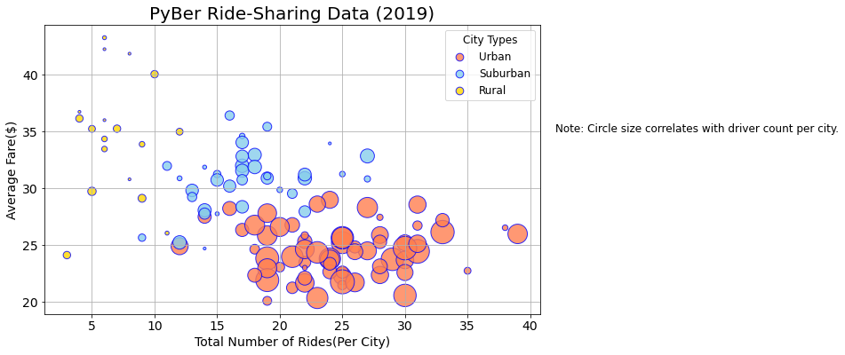
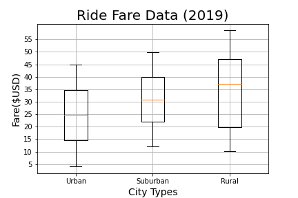
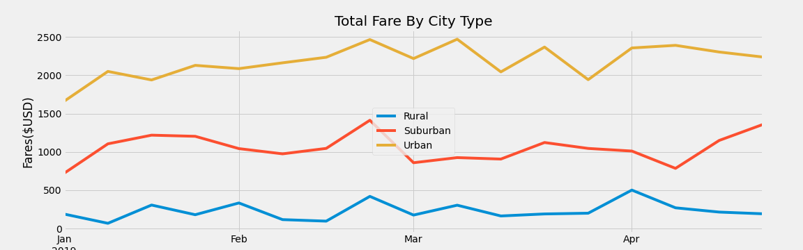

# PyBer Analysis
## Project Overview

The goal of this rideshare analysis is to compare and contrast the fares, number of rides, number of drivers across the different city types: rural, suburban, and urban. 

## Results

 - Overall Comparison
 
    As expected most transactions, riders and drivers concentrate in urban cities, a moderate number are in suburban cities, and the least in rural cities. 
- Rural area key difference

  The only areas where rural cities out performed suburban and urban cities are average fare per driver and average fare per ride. Despite having the fewest riders, fewest drivers, rural cities had the hightest average fare per driver, at more than three times urban cities, and almost one and a half times suburban cities. Average fare per ride was also higher, however, less dramatic.. 
- Trend over time

    The trend is consistent throughout the first third of the year. The total fare by city type followed similar trends through the first four months
 
 ## Summary

 With additional data, such as average hourly wage per driver based on city type, rider feedback regarding value of service, driver feedback regarding what attracted them to the city type they serve, we could finetune the best next steps to potentially increase riders and drivers in rural and suburban areas, decrease the average fare per ride in rural and suburban areas to increase demand. The goal would be to increase the quality and hence value of the service to the riders, expanding access to areas that may be underserved. The target is to improve and increase rural and suburban area rider and driver experience. As a bonus it may attract more riders and drivers to all city types and further increasing urban riders and drivers.
